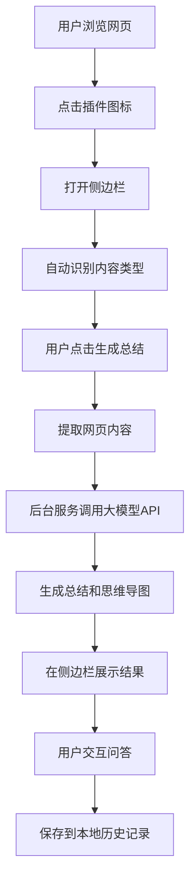

## 1. 产品概述
Luma是一款智能浏览器插件，通过调用大模型API自动总结网页内容（文章、图片、视频），并生成结构化的概要和思维导图。帮助用户快速理解复杂内容，提升信息获取效率。

目标用户：学生、研究人员、内容创作者、需要快速理解网页内容的职场人士。

## 2. 核心功能

### 2.1 用户角色
| 角色 | 注册方式 | 核心权限 |
|------|----------|----------|
| 免费用户 | 插件安装即用 | 基础总结功能（每日限额）、本地历史存储 |
| 高级用户 | API密钥配置 | 无限制使用、自定义模型参数、导出功能 |

### 2.2 功能模块
Luma包含以下核心功能模块：

1. **内容提取模块**：自动识别并提取网页中的文章、图片、视频内容
2. **智能总结模块**：一键生成内容概要，支持自定义提示词和长度
3. **思维导图模块**：将总结内容可视化为交互式思维导图
4. **智能问答模块**：基于当前页面内容进行问答交互
5. **历史管理模块**：本地存储和管理历史总结记录

### 2.3 页面详情
| 页面名称 | 模块名称 | 功能描述 |
|----------|----------|----------|
| 侧边栏主界面 | 内容分析区 | 显示当前页面内容类型识别结果，提供一键分析按钮 |
| 侧边栏主界面 | 总结展示区 | 展示生成的内容概要，支持复制和导出功能 |
| 侧边栏主界面 | 思维导图区 | 渲染交互式思维导图，支持缩放和节点展开/收起 |
| 侧边栏主界面 | 智能问答区 | 输入框用于提问，显示问答历史记录 |
| 侧边栏主界面 | 历史记录区 | 列表展示过往总结记录，支持搜索和重新加载 |
| 设置页面 | API密钥管理 | 配置OpenAI/Gemini/Claude等API密钥，支持验证连接状态 |
| 设置页面 | 模型参数设置 | 自定义模型选择、温度参数、最大token数等高级参数 |
| 设置页面 | 偏好设置 | 自定义总结长度、语言、输出格式等基础参数 |
| 设置页面 | 安全设置 | API密钥加密存储、数据清除、隐私选项 |

## 3. 核心流程

### 用户操作流程：
1. 首次使用：用户点击插件图标，进入设置页面配置API密钥
2. 密钥验证：用户输入API密钥后点击"验证连接"按钮测试有效性
3. 日常使用：用户浏览网页时点击插件图标
4. 侧边栏自动打开并分析当前页面内容
5. 用户点击"生成总结"按钮
6. 插件提取内容并通过后台服务调用用户配置的大模型API
7. 在侧边栏展示总结和思维导图
8. 用户可以进行问答交互或保存历史

### API密钥管理流程：
1. 用户进入设置页面的API密钥管理模块
2. 选择要配置的模型提供商（OpenAI/Gemini/Claude/自定义）
3. 输入API密钥和自定义参数（如Base URL）
4. 点击"验证连接"按钮测试API连通性
5. 系统显示验证结果（成功/失败及错误信息）
6. 验证通过后密钥加密保存到本地存储
7. 用户可随时更新或删除已保存的API密钥

## 4. 用户界面设计

### 4.1 设计风格
- **主色调**：深空蓝(#1a1a2e)搭配亮蓝(#16213e)作为渐变背景
- **强调色**：青色(#0f4c75)用于按钮和重要元素
- **文字色**：纯白(#ffffff)为主，浅灰(#b8b8b8)为辅助文字
- **按钮样式**：圆角矩形设计，悬停效果使用透明度变化
- **字体**：Inter字体家族，主标题16px，正文14px，小字12px
- **布局风格**：侧边栏采用卡片式布局，内容分区明确
- **图标风格**：使用简约的线性图标，统一线条粗细

### 4.2 页面设计概览
| 页面名称 | 模块名称 | UI元素 |
|----------|----------|----------|
| 侧边栏主界面 | 内容分析区 | 顶部状态栏显示当前页面图标和标题，一键分析按钮居中显示，加载动画使用脉冲效果 |
| 侧边栏主界面 | 总结展示区 | 卡片式容器展示总结内容，支持展开/收起长文本，顶部有复制和导出按钮 |
| 侧边栏主界面 | 思维导图区 | 全宽卡片容器，使用Vue Flow渲染可交互导图，支持缩放控制和全屏查看 |
| 侧边栏主界面 | 智能问答区 | 底部固定输入框，上方聊天记录区域，支持Markdown渲染和代码高亮 |
| 侧边栏主界面 | 历史记录区 | 侧边抽屉式设计，按时间倒序排列，支持关键词搜索和标签筛选 |

### 4.3 响应式设计
- **桌面端优先**：侧边栏宽度固定400px，高度自适应浏览器窗口
- **移动端适配**：支持触摸手势操作，优化按钮点击区域
- **键盘快捷键**：支持Ctrl+Shift+W快速打开/关闭侧边栏

## 5. 技术实现要点

### 5.1 内容提取策略
- **文章页面**：使用Readability.js库提取正文内容，自动去除广告和导航
- **视频内容**：YouTube视频使用Transcript API获取字幕，其他平台使用视频标题和描述
- **图片内容**：通过多模态大模型API分析图片内容，生成文字描述

### 5.2 API调用优化
- **缓存机制**：相同URL的内容总结结果缓存24小时
- **批处理**：支持批量处理多个页面的总结请求
- **错误处理**：网络超时自动重试，API限额提示升级方案

### 5.3 性能优化
- **懒加载**：思维导图组件按需加载，减少初始包体积
- **虚拟滚动**：历史记录列表使用虚拟滚动处理大量数据
- **内存管理**：及时清理大文本内容，避免内存泄漏

### 5.4 BYOK（Bring Your Own Key）架构特点
- **用户密钥管理**：用户自主配置和管理API密钥，完全控制数据访问权限
- **多模型支持**：支持OpenAI、Google Gemini、Anthropic Claude等主流大模型
- **自定义接入**：支持自定义Base URL，兼容本地部署模型（如Ollama）和代理服务
- **安全存储**：API密钥使用chrome.storage.local加密存储，不上传到任何服务器
- **连接验证**：提供一键验证功能，确保API密钥有效性和网络连通性
- **灵活切换**：用户可随时切换不同的模型提供商，无需重新安装插件

### 5.5 安全与隐私保护
- **本地优先**：所有数据处理在本地完成，保护用户隐私
- **加密存储**：敏感信息使用浏览器原生加密机制存储
- **权限最小化**：仅申请必要的浏览器权限，不收集用户浏览数据
- **透明可控**：用户完全控制自己的API密钥和数据使用