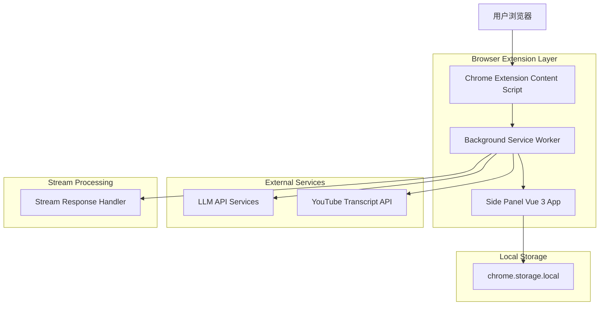
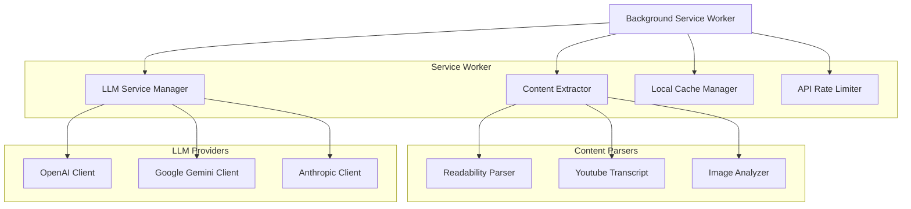
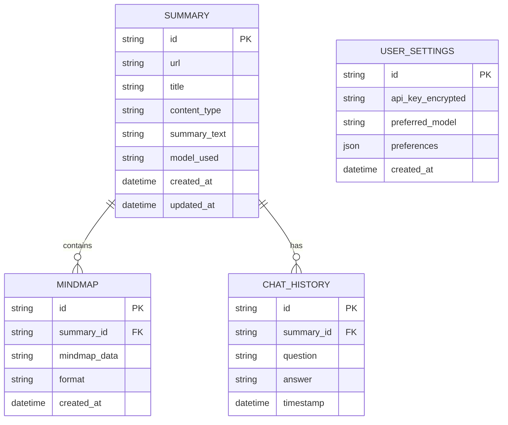

## 1. 架构设计



## 2. 技术栈描述

- **前端框架**: Vue 3@latest + TypeScript + Vite
- **状态管理**: Pinia + VueUse Composables
- **UI框架**: TailwindCSS@3 + Shadcn-Vue (Radix Vue)
- **扩展框架**: Chrome Extension Manifest V3
- **可视化库**: Vue Flow（思维导图）+ Mermaid.js（图表）
- **内容提取**: Readability.js（文章）+ Youtube Transcript API（视频字幕）
- **LLM集成**: LangChain.js + 多模型支持（OpenAI/Gemini/Claude）
- **初始化工具**: vite-init
- **后端架构**: Serverless / Local-first（无后端服务）

## 3. 路由定义

| 路由 | 用途 |
|-------|---------|
| / | 侧边栏主界面，内容分析和展示 |
| /settings | 设置页面，API密钥和偏好配置 |
| /history | 历史记录页面，管理过往总结 |
| /chat | 智能问答界面，与内容对话 |

## 4. 核心组件架构

### 4.1 Vue Composables定义

**内容提取Composable**
```typescript
// useContentExtractor.ts
export interface ExtractedContent {
  title: string
  content: string
  contentType: 'article' | 'video' | 'image'
  images: string[]
  metadata: Record<string, any>
}

export function useContentExtractor() {
  const extractContent = async (tabId: number): Promise<ExtractedContent> => {
    // 实现内容提取逻辑
  }
  
  return {
    extractContent,
    isLoading: readonly(isLoading)
  }
}
```

**LLM服务Composable**
```typescript
// useLLMService.ts
export interface SummaryRequest {
  content: string
  model?: string
  maxLength?: number
  language?: string
}

export interface SummaryResponse {
  summary: string
  keywords: string[]
  sentiment: string
}

export function useLLMService() {
  const generateSummary = async (request: SummaryRequest): Promise<SummaryResponse> => {
    // 通过background script调用LLM API
  }
  
  return {
    generateSummary,
    availableModels: readonly(models)
  }
}
```

### 4.2 状态管理定义

**历史记录Store**
```typescript
// stores/useHistoryStore.ts
export interface SummaryHistory {
  id: string
  url: string
  title: string
  contentType: string
  summary: string
  createdAt: Date
}

export const useHistoryStore = defineStore('history', () => {
  const histories = ref<SummaryHistory[]>([])
  
  const addHistory = (summary: SummaryHistory) => {
    histories.value.unshift(summary)
  }
  
  const searchHistory = (keyword: string) => {
    return histories.value.filter(h => 
      h.title.includes(keyword) || h.summary.includes(keyword)
    )
  }
  
  return {
    histories: readonly(histories),
    addHistory,
    searchHistory
  }
})
```

## 5. 服务器架构说明

**Serverless架构设计**：
- **无后端服务**：核心功能完全在浏览器扩展中实现，无需部署后端服务器
- **本地存储**：用户数据和历史记录使用chrome.storage.local存储
- **后台处理**：LLM API调用通过Background Service Worker处理，解决CORS问题
- **安全隔离**：API密钥等敏感信息仅在本地存储，不会上传到任何服务器



## 6. 数据存储模型

### 6.1 本地存储结构



### 6.2 Chrome Storage API使用

**总结记录存储**
```typescript
// 存储总结记录
const saveSummary = async (summary: SummaryRecord) => {
  const key = `summary_${summary.id}`
  await chrome.storage.local.set({ [key]: summary })
}

// 获取所有总结记录
const getAllSummaries = async (): Promise<SummaryRecord[]> => {
  const items = await chrome.storage.local.get()
  return Object.keys(items)
    .filter(key => key.startsWith('summary_'))
    .map(key => items[key])
    .sort((a, b) => b.createdAt - a.createdAt)
}
```

**用户设置存储**
```typescript
// 加密存储API密钥 - 使用chrome.storage.local确保长期存储
const saveApiKey = async (provider: string, apiKey: string, baseUrl?: string) => {
  const encryptedKey = await encrypt(apiKey) // 使用浏览器原生加密
  await chrome.storage.local.set({ 
    [`api_config_${provider}`]: {
      apiKey: encryptedKey,
      baseUrl: baseUrl || getDefaultBaseUrl(provider),
      lastVerified: Date.now()
    }
  })
}

// 获取API配置
const getApiConfig = async (provider: string) => {
  const result = await chrome.storage.local.get(`api_config_${provider}`)
  const config = result[`api_config_${provider}`]
  if (config?.apiKey) {
    config.apiKey = await decrypt(config.apiKey)
  }
  return config
}

// 验证API连接
const verifyApiConnection = async (provider: string, apiKey: string, baseUrl?: string) => {
  try {
    const response = await fetch(`${baseUrl}/v1/models`, {
      headers: {
        'Authorization': `Bearer ${apiKey}`,
        'Content-Type': 'application/json'
      }
    })
    return response.ok
  } catch (error) {
    console.error('API连接验证失败:', error)
    return false
  }
}
```

## 7. 扩展组件架构

### 7.1 Manifest V3 配置
```json
{
  "manifest_version": 3,
  "name": "Luma - AI Content Summarizer",
  "version": "1.0.0",
  "description": "智能网页内容总结和思维导图生成工具",
  "permissions": [
    "activeTab",
    "storage",
    "sidePanel",
    "scripting"
  ],
  "host_permissions": [
    "https://api.openai.com/*",
    "https://generativelanguage.googleapis.com/*",
    "https://api.anthropic.com/*"
  ],
  "background": {
    "service_worker": "background.js"
  },
  "content_scripts": [
    {
      "matches": ["<all_urls>"],
      "js": ["content-script.js"]
    }
  ],
  "side_panel": {
    "default_path": "sidepanel.html"
  },
  "action": {
    "default_title": "打开Luma"
  }
}
```

### 7.2 核心模块职责

**Content Script模块**：
- 注入到网页中，提取页面内容
- 监听页面变化，更新内容状态
- 与Background Script通信

**Background Service Worker模块**：
- 处理跨域API请求
- 管理API密钥和配置
- 实现请求缓存和限流
- 协调各个组件间的消息传递

**Side Panel Vue 3应用**：
- 提供用户界面
- 使用Pinia管理本地状态
- 处理用户交互和输入
- 渲染Vue Flow可视化组件

**Vue组件架构**：
```
src/
├── components/
│   ├── SummaryCard.vue          # 总结展示卡片
│   ├── MindmapViewer.vue        # 思维导图查看器
│   ├── ChatInterface.vue        # 问答界面
│   └── HistoryPanel.vue         # 历史记录面板
├── composables/
│   ├── useContentExtractor.ts   # 内容提取逻辑
│   ├── useLLMService.ts       # LLM服务
│   ├── useMindmapGenerator.ts # 思维导图生成
│   └── useHistory.ts          # 历史记录管理
├── stores/
│   ├── useHistoryStore.ts     # 历史记录状态
│   ├── useSettingsStore.ts    # 设置状态
│   └── useSummaryStore.ts     # 总结数据状态
└── utils/
    ├── message.ts              # 扩展消息通信
    ├── storage.ts              # 存储工具
    └── encryption.ts           # 加密工具
```

## 8. 安全和隐私考虑

### 8.1 BYOK数据安全
- **本地存储**: API密钥使用chrome.storage.local加密存储，不上传到任何服务器
- **加密机制**: 使用浏览器原生加密API，确保密钥安全
- **密钥隔离**: 不同提供商的API密钥分开存储，避免混淆
- **验证机制**: 提供API连接验证功能，确保密钥有效性
- **访问控制**: 密钥仅在Background Service Worker中使用，不向内容脚本暴露
- **清除机制**: 提供一键清除所有API密钥的功能

### 8.2 多模型支持架构
```typescript
// 模型提供商配置
interface ModelProvider {
  id: string
  name: string
  baseUrl: string
  apiKeyRequired: boolean
  models: string[]
  headers?: Record<string, string>
}

const PROVIDERS: ModelProvider[] = [
  {
    id: 'openai',
    name: 'OpenAI',
    baseUrl: 'https://api.openai.com',
    apiKeyRequired: true,
    models: ['gpt-3.5-turbo', 'gpt-4', 'gpt-4-turbo']
  },
  {
    id: 'gemini',
    name: 'Google Gemini',
    baseUrl: 'https://generativelanguage.googleapis.com',
    apiKeyRequired: true,
    models: ['gemini-pro', 'gemini-pro-vision']
  },
  {
    id: 'claude',
    name: 'Anthropic Claude',
    baseUrl: 'https://api.anthropic.com',
    apiKeyRequired: true,
    models: ['claude-3-haiku', 'claude-3-sonnet', 'claude-3-opus']
  },
  {
    id: 'custom',
    name: '自定义',
    baseUrl: '', // 用户自定义
    apiKeyRequired: false,
    models: [] // 用户自定义
  }
]

// 统一的LLM服务接口
class LLMService {
  async generateSummary(provider: string, model: string, content: string): Promise<SummaryResponse> {
    const config = await getApiConfig(provider)
    if (!config?.apiKey) {
      throw new Error(`未找到${provider}的API密钥`)
    }
    
    // 根据提供商调用不同的API
    switch (provider) {
      case 'openai':
        return this.callOpenAI(config, model, content)
      case 'gemini':
        return this.callGemini(config, model, content)
      case 'claude':
        return this.callClaude(config, model, content)
      default:
        return this.callCustomProvider(config, model, content)
    }
  }
}
```

### 8.2 隐私保护
- 默认不收集用户浏览数据
- 总结内容仅在本地存储
- 提供数据清除功能
- 遵循最小权限原则

### 8.3 性能优化
- 实现智能缓存策略，避免重复API调用
- 使用Web Workers处理大文本分析
- 实现渐进式加载和虚拟滚动
- 优化包体积，按需加载第三方库

### 8.4 流式响应处理
- **Server-Sent Events**：在Service Worker中处理SSE流式响应
- **实时转发**：将流式数据实时转发到Side Panel
- **连接管理**：维护请求连接状态，处理连接中断和重连
- **错误处理**：流式响应中的错误处理和用户通知

```typescript
// 流式响应处理示例
class StreamResponseHandler {
  async handleStreamResponse(
    requestId: string,
    provider: string,
    content: string
  ) {
    const config = await getApiConfig(provider)
    
    // 创建SSE连接
    const eventSource = new EventSource(
      `${config.baseUrl}/v1/chat/completions`,
      {
        headers: {
          'Authorization': `Bearer ${config.apiKey}`,
          'Content-Type': 'application/json'
        }
      }
    )
    
    eventSource.onmessage = (event) => {
      const data = JSON.parse(event.data)
      // 转发到Side Panel
      chrome.runtime.sendMessage({
        action: 'streamData',
        requestId,
        data: data.choices[0]?.delta?.content || ''
      })
    }
    
    eventSource.onerror = (error) => {
      chrome.runtime.sendMessage({
        action: 'streamError',
        requestId,
        error: error.message
      })
      eventSource.close()
    }
  }
}
```

### 8.5 CORS处理策略
- 所有外部API调用通过Background Service Worker处理
- 在manifest.json中声明必要的host_permissions
- 实现请求失败的重试机制
- 提供用户友好的错误提示

## 9. 开发环境配置

### 9.1 项目初始化
```bash
# 使用Vite初始化Vue 3项目
npm create vite@latest luma --template vue-ts

# 安装核心依赖
npm install pinia vueuse @vue-flow/core
npm install -D @types/chrome tailwindcss shadcn-vue
```

### 9.2 构建配置
- 配置Vite支持Chrome Extension构建
- 设置多入口（background、content-script、side-panel）
- 配置热重载支持开发调试
- 优化构建输出，减小扩展包体积